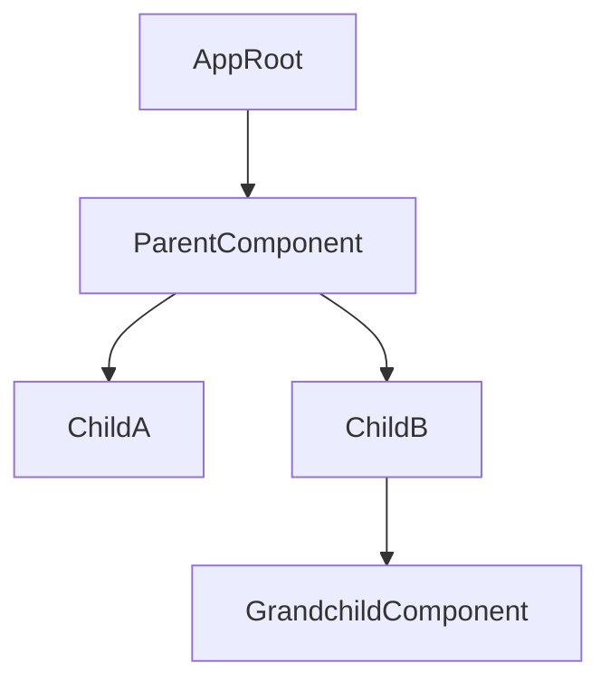

# Render Hotspots & Cascade Depth

The **Render Hotspots** metric inside ngLens aggregates multiple performance metrics (including re-render counts, renders-per-minute, execution cost, nesting depth, and trigger root causes) into a weighted score (from 0 to 100). This immediately highlights parts of the application causing systemic rendering bottlenecks.

---

## The Hotspot Scoring System

Scores above **70** are flagged by ngLens as high-priority hotspots that require immediate review:

$$\text{Hotspot Score} = w_1(\text{Render Count}) + w_2(\text{Nesting Depth}) + w_3(\text{Template Complexity}) + w_4(\text{Low CD-MER})$$

* **Render Count:** High frequency triggers increase the score.
* **Nesting Depth:** Deeper tree levels ($> 5$ levels) penalize nesting, as they amplify parent renders.
* **Template Complexity:** Declared variables, inline calculations, and layout tags.
* **Low CD-MER:** Poor change-detection efficiency multiplies the score penalization, indicating wasteful CPU passes.

---

## Understanding Cascade Depth

In standard Angular development, change detection moves unidirectionally downward from the root component:


When a parent's change detector runs under `Default` change detection, **all children and grandchildren down the tree are forced to evaluate their templates too.**
If `Parent` re-renders 50 times because of a timer, `Grandchild` also evaluates 50 times—even if its inputs remain identical. This cascading ripple is measured by ngLens under the `Parent Cascade` cause.

---

## Architectural Remedies for Hotspots

### 1. Pinpoint the Cascade Trigger
Open the **Render Inspector** tab in the DevTools panel and expand the target component. If the dominant cause is `Parent Cascade`, implement `OnPush` on both the component and its direct parents to block the rendering ripples.

### 2. Isolate State Nodes
Split high-frequency properties (like ticking clocks, live search filters, or dynamic progress bars) into small, dedicated sub-components. By encapsulating these inputs, change detection is isolated to a small subset of the layout:
```html
<!-- BEFORE: Updating search query forces the entire Dashboard to re-render -->
<div>
  <input [(ngModel)]="searchQuery" />
  <app-expensive-charts />
</div>

<!-- AFTER: Isolate input triggers to avoid heavy chart re-renders -->
<div>
  <app-search-input />
  <app-expensive-charts />
</div>
```

### 3. Use Pure Pipes to cached values
If you have nested values, use pure pipes. If parent components trigger deep re-runs, pure pipes will skip recalculation because they memoize values on their inputs.
